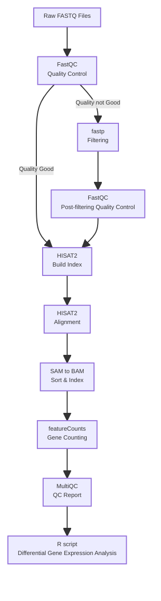

#### **Project Description**
##### This project provides a comprehensive RNA-seq  analysis pipeline for differential gene expression analysis. The implementation covers the complete preprocessing workflow from raw sequencing data to gene expression quantification, preparing the data for downstream differential expression analysis using R. The analysis focuses on lung tissues from wild-type (WT) and interferon receptor double knockout (Ifnar⁻/⁻ × Ifngr⁻/⁻, DKO) mice under Toxoplasma gondii infected and uninfected conditions.
#### **Analysis Pipline**

#### **Upstream Analysis_Gene Expression Quantification**
#### **Project Structure**

```
rnaseq_project folder structure
├── data/
│   ├── raw_data/                 # Post-filtering FASTQ files
│   ├── processed_data/           # All results of upstream analysis
│   │   ├── fastqc/                    # Initial FastQC reports
│   │   ├── fastqc_clean/              # Post-filtering QC reports
│   │   ├── hisat2_index/              # HISAT2 index files
│   │   ├── bam/                       # bam files
│   │   ├── bam_sorted/                # Sorted bam files and index files (BAM/BAI)
│   │   ├── featureCounts/             # Gene counts file
│   │   ├── samples.txt                # Samples information file
│   └── external_data/            # Reference genome & annotation
├── scripts/
│   ├── 01_run_fastqc.sh          # Initial quality control
│   ├── 02_create_sample_list.sh  # Generate the sample_list.txt 
│   ├── 03_run_fastp.sh           # Run fastp to filter reads
│   ├── 04_run_fastqc_clean.sh    # Re-run fastqc for filtered reads
│   ├── 05_run_hisat2_build.sh    # Generate the hisat2 index
│   ├── 06_run_hisat2.sh          # Run hisat2 to allign to the reference genome and generate .sam file and convert to .bam file
│   ├── 07_sort_bam.sh            # Sort the bam file according to the gene position on genome
│   ├── 08_run_samtools_index.sh  # Generate the .bai file for .bam file
│   ├── 09_run_featureCounts.sh   # Gene counting
│   ├── 10_modify_counfile.sh     # Modify the counts file to remove the first line and no need column
│   └── 11_run_multiQC.sh         # Generate a summary QC report using multiQC
    └── 12__rnaseq_downstream_analysis.R         
├── results/
│   └── multiqc_report/           # Integrated QC report
└── README.md                     # This document
```
#### **Prerequisites**
- Required Apptainer
    - fastqc-0.12.1.sif 
    - multiqc-1.19.sif
    - fastp_0.24.1.sif
    - hisat2_samtools_408dfd02f175cd88.sif
    - subread_2.0.6.sif
- Reference File
    - .gtf file for reference genome
      - https://ftp.ensembl.org/pub/release-115/gtf/mus_musculus/
    - .fa file for reference genome
      - https://ftp.ensembl.org/pub/release-115/fasta/mus_musculus/dna/
#### **Step-by Step Execution**
##### Step 1: Initial Quality Control
```bash
# submit to cluster
# the dir of the raw fastq file should provide to script as the $FASTQ_DIR
# apptainer: fastqc-0.12.1.sif and multiqc-1.19.sif
sbatch ./scripts/01_run_fastqc.sh
```
##### Output:
```
processed_data/fastqc/
├── multiqc_data/
│    ├── multiqc_fastqc.txt
│    └── ...
├── multiqc_report.html
├── sample1_R1_fastqc.zip
├── sample1_R2_fastqc.html
├── sample1_R2_fastqc.zip
└── ...
```
##### Step 2: Read filtering with fastp
```bash
# generate sample list for slurm array
# apptainer: fastp_0.24.1.sif
sbatch ./scripts/02_create_sample_list.sh
sbatch ./scripts/03_run_fastp.sh
```
##### Filtering Parameter:
- Adapter trimming(--detect_adapter_for_pe)
##### Output:
```
raw_data/clean_fastp/
├── sample1_R1_clean.fastq.gz
├── sample1_R2_clean.fastq.gz
└── ...  
```
##### Step 3: Re-run fastqc
```bash
# the dir of the trimmed fastq file should provide to script as the $INPUT_DIR
# apptainer: fastqc-0.12.1.sif and multiqc-1.19.sif
sbatch ./scripts/04_run_fastqc_clean.sh
```
##### Output:
```
processed_data/fastqc_clean/
├── multiqc_data/
│    ├── multiqc_fastqc.txt
│    └── ...
├── multiqc_report.html
├── sample1_R1_clean_fastqc.zip
├── sample1_R2_clean_fastqc.html
├── sample1_R2_clean_fastqc.zip
└── ...
```
##### Step 4: HISAT2 index preparation
```bash
# apptainer: hisat2_samtools_408dfd02f175cd88.sif
# command: hisat2-build
# parameter: -f (#  reference genome file FASTA format) 
sbatch ./scripts/05_run_hisat2_build.sh
```
##### Output:
total 8 index files
```
processed_data/hisat2_index/
├── Mus_musculus.1.ht2
├── Mus_musculus.2.ht2
└── ...  
```
##### Step 5: Reads alignment
```bash
# Part1: alignment
# apptainer: hisat2_samtools_408dfd02f175cd88.sif
# command: hisat2
# parameter: --rna-strandness RF (# strand orientation of strand-specific RNA-seq reads, RF means Read1: Comes from the antisense strand (R)Read2: Comes from the sense strand (F))
#Part2: SAM format convert to BAM format
# apptainer: hisat2_samtools_408dfd02f175cd88.sif
# command: samtools view 
# parameter: -hbS -@ 4
# -h: output include the header information
# -b: output format is BAM
# -S: input format is SAM
# -@ 4: threads 4
sbatch ./scripts/06_run_hisat2.sh
```
##### Step 6: BAM file sorted by genome coordinates
```bash
# apptainer: hisat2_samtools_408dfd02f175cd88.sif
# command: samtools sort
# parameter: -m 6G -@ 2
# -m: memory for each thread
# -@ : threads 
sbatch ./scripts/07_sort_bam.sh
```
##### Step 7: Creat index for sorted BAM
```bash
# apptainer: hisat2_samtools_408dfd02f175cd88.sif
# command: samtools index 
sbatch ./scripts/08_run_samtools_index.sh
```
##### Output
```
processed_data/bam_sorted/
├── sample1_sorted.bam.bai
├── sample2_sorted.bam.bai
└── ...  
```
##### Step 8: Gene expression quantification
```bash
# apptainer: subread_2.0.6.sif
# command: featureCounts
# parameters:
# -T	16	For multi-threading
# -s	2	For reverse-stranded libraries
# -p	/	For paired-end reads
# --countReadPairs	/	Specifies that paired-end reads should be counted as fragments
# -B	/	Only count read pairs where both ends are successfully mapped
# -C	/	Do not count chimeric fragments
# -a	.gtf file	annotation file
# -t	exon	To count reads overlapping exonic regions
# -g	gene_id	To aggregate counts by gene identifier
# -o	output path	Specify the output path
 
sbatch ./scripts/09_run_featureCounts.sh
```
##### Output
```
processed_data/featureCounts/
├── counts.txt
├── counts.txt.summary  
```
##### Step 9: Gene expression quantification
```bash
# delete the counts.txt first row and delete the 2,3,4,5,6 columns of this .txt file
sbatch ./scripts/10_modifiy_countfile.sh
```
##### Output
```
processed_data/featureCounts/
├── counts_modified.txt
```
##### Step 10: Generate a summary file for all above steps 
```bash
# apptainer:  multiqc-1.19.sif
# parameter；
# --ignore: ignore the no need files
sbatch ./scripts/11_run_multiQC.sh
```
#### **Downstream Analysis_Differential Gene Expression Analysis**
##### Step 11: Differential Gene Expression Analysis
##### Stage 1. Preparation
###### R and RStudio version
- R version: 4.4.2
- RStudio version: 2024.09.1+394
###### System requirement
- Operation system: Windows
###### Data Preparation
- counts matrix: counts_modified.txt
###### Package version
- DESeq2: 1.46.0 version
- ggplot2: 4.0.1 version
- clusterProfiler: 4.14.4 version
- org.Mm.eg.db: 3.20.0 version
- reshape2: 1.4.4 version
- dplyr: 1.1.4 version
- ggrepel: 0.9.6 version
- ggpubr: 0.6.2 version
- enrichplot: 1.26.6
- patchwork: 1.3.2
##### Stage 2. Analysis workflow
- Data import and preprocessing
- Differential expression analysis using DESeq2
- Exploratory data analysis (PCA)
- Visualization of results (volcano plots)
- Functional enrichment analysis (Gene Ontology)
- Visualization of candidate genes(dot plot)
##### Folder Structure
```
D:/Bioinformatics/
│
├── rna_seq/
│   ├── count_modified.txt
│   
│
├── rnaseq_course/
│   ├──scripts
       ├── 12_rnaseq_downstream_analysis.R
```
##### How to Run the Analysis

- Open RStudio and set the working directory to the project folder:
```
setwd("path/to/project_directory")
```
###### * Due to need import the count_modified.txt to R script, set the working directory to the"D:/Bioinformatics/rna_seq/counts_modified.txt" 

- Run the scripts in the following order:
```
source("D:/Bioinformatics/rnaseq_course/scripts/12_rnaseq_downstream_analysis.R")
```

- All output files will be saved automatically in the  scripts/ directory.

##### Output Files

- PCA plot

  - Visualization of sample clustering

- Volcano plot

  - Overview of differentially expressed genes

- GO enrichment results

  - Enriched biological processes

  - Dot plots and gene–term network plots

- Expression of candidate genes 

  - Dot plot for the expression of candidate genes


Contact

For questions or issues regarding this analysis, please contact:
jiajing.li@students.unibe.ch