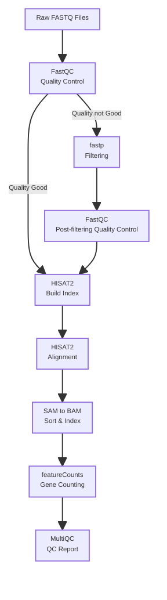

#### **Project Description**
##### This project provides a comprehensive RNA-seq  analysis pipeline for differential gene expression analysis. The implementation covers the complete preprocessing workflow from raw sequencing data to gene expression quantification, preparing the data for downstream differential expression analysis. 
#### **Analysis Pipline**


#### **Project Structure**

```
rnaseq_project folder structure
├── data/
│   ├── raw_data/                 # Post-filtering FASTQ files
│   ├── processed_data/           # All results of upstream analysis
│   │   ├── fastqc/                    # Initial FastQC reports
│   │   ├── fastqc_clean/              # Post-filtering QC reports
│   │   ├── hisat2_index/              # HISAT2 index files
│   │   ├── bam/                       # bam files
│   │   ├── bam_sorted/                # Sorted bam files and index files (BAM/BAI)
│   │   ├── featureCounts/             # Gene counts file
│   │   ├── samples.txt                # Samples information file
│   └── external_data/            # Reference genome & annotation
├── scripts/
│   ├── 01_run_fastqc.sh          # Initial quality control
│   ├── 02_create_sample_list.sh  # Generate the sample_list.txt 
│   ├── 03_run_fastp.sh           # Run fastp to filter reads
│   ├── 04_run_fastqc_clean.sh    # Re-run fastqc for filtered reads
│   ├── 05_run_hisat2_build.sh    # Generate the hisat2 index
│   ├── 06_run_hisat2.sh          # Run hisat2 to allign to the reference genome and generate .sam file and convert to .bam file
│   ├── 07_sort_bam.sh            # Sort the bam file according to the gene position on genome
│   ├── 08_run_samtools_index.sh  # Generate the .bai file for .bam file
│   ├── 09_run_featureCounts.sh   # Gene counting
│   ├── 10_modify_counfile.sh     # Modify the counts file to remove the first line and no need column
│   └── 11_run_multiQC.sh         # Generate a summary QC report using multiQC
├── results/
│   └── multiqc_report/           # Integrated QC report
├── logs/                         # Pipeline execution logs
└── README.md                     # This document
```
#### **Prerequisites**
- Required Apptainer
    - fastqc-0.12.1.sif 
    - multiqc-1.19.sif
    - fastp_0.24.1.sif
    - hisat2_samtools_408dfd02f175cd88.sif
    - subread_2.0.6.sif
- Reference File
    - .gtf file for reference genome
      - https://ftp.ensembl.org/pub/release-115/gtf/mus_musculus/
    - .fa file for reference genome
      - https://ftp.ensembl.org/pub/release-115/fasta/mus_musculus/dna/
#### **Step-by Step Execution**
##### Step 1: Initial Quality Control
```bash
# submit to cluster
# the dir of the raw fastq file should provide to script as the $FASTQ_DIR
sbatch ./scripts/01_run_fastqc.sh
```
##### Output:
```
processed_data/fastqc/
├── multiqc_data/
│    ├── multiqc_fastqc.txt
│    └── ...
├── multiqc_report.html
├── sample1_R1_fastqc.zip
├── sample1_R2_fastqc.html
├── sample1_R2_fastqc.zip
└── ...
```
##### Step 2: Read filtering with fastp
```bash
# generate sample list for slurm array
sbatch ./scripts/02_create_sample_list.sh
sbatch ./scripts/03_run_fastp.sh
```
##### Filtering Parameter:
- Adapter trimming(--detect_adapter_for_pe)
##### Output:
```
raw_data/clean_fastp/
├── sample1_R1_clean.fastq.gz
├── sample1_R2_clean.fastq.gz
└── ...  
```